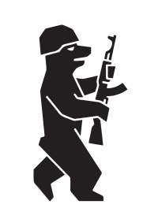
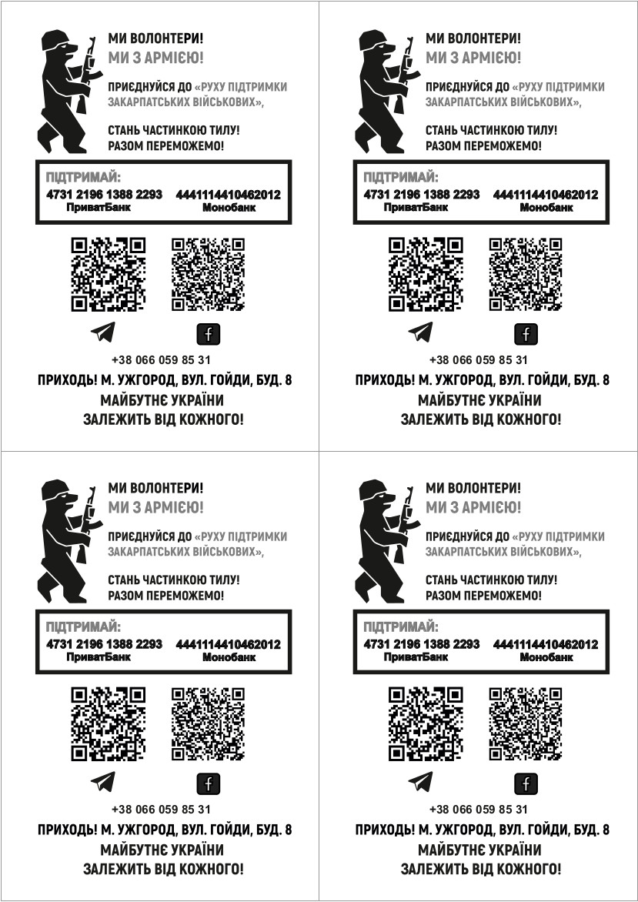
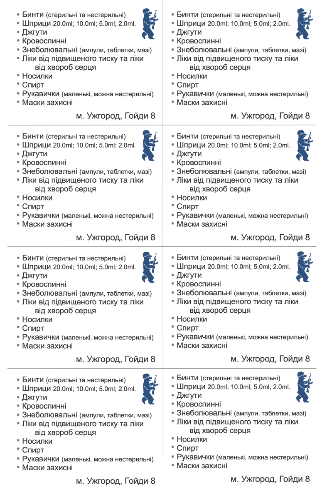
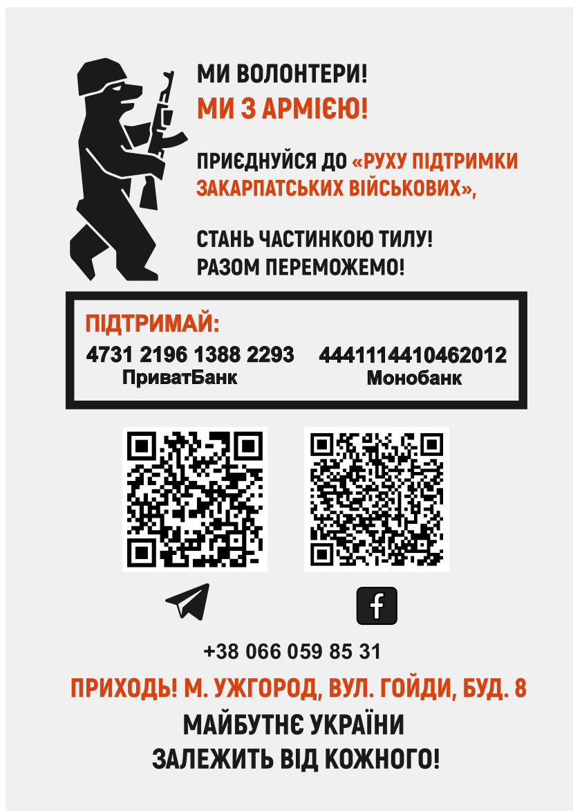

# Рух підтримки закарпатских військових / Transcarpathian military support movement

## Для іноземців / For foreign:
- For cash: `Name of the bank CB: 1D Hrushevskoho str., Kyiv, 01001, Ukraine`
- MFO (Interbranch Turnover): `305299`
- Recipient: `Skunts Mykola (Скунць Микола Петрович)`
- IBAN: `UA323052990000026201678468315`
- Recipient account: `26201678468315`
- Currency: `UAH`
- Taxpayer identification number: `2443402437`
- Purpose of payment - money transfer to: `Skunts Mykola`

## В Україні:
### Картка Приватбанку:
`4731 2196 1388 2993` отримувач `Скунць Микола Петрович`

### Картка Монобанка:
`4441 1144 1046 2012`

## [Завантажити матеріали для другу та роповсюдження (Google Диск)](https://drive.google.com/drive/folders/15cBdEUbLbBouU3aS3KbWv8B3DBbliJn9?usp=sharing) 

